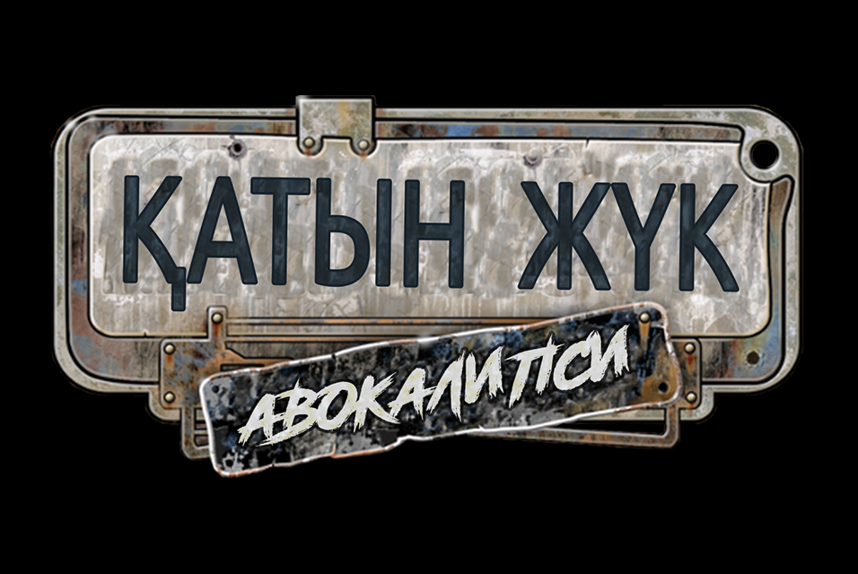

  
   
  
  
  
  
  

***

  

    <h3>Контакты автора / Author's contacts</h3>
    
    
    
    
    
  

***

  <table>
    <thead>
      <tr>
        <th style="text-align: center;">Содержание</th>
        <th style="text-align: center;">Table of contents</th>
      </tr>
    </thead>
    <tbody align="center">
      <tr>
        <td><a href="#description_rus">Описание</a></td>
        <td><a href="#description_eng">Description</a></td>
      </tr>
      <tr>
        <td><a href="#changelist_rus">Список изменений</a></td>
        <td><a href="#changelist_eng">Change list</a></td>
      </tr>
      <tr>
        <td><a href="#download_rus">Скачать</a></td>
        <td><a href="#download_eng">Download links</a></td>
      </tr>
      <tr>
        <td><a href="#installation_rus">Установка</a></td>
        <td><a href="#installation_eng">Installation guide</a></td>
      </tr>
      <tr>
        <td><a href="#other_mods_rus">Мои другие проекты</a></td>
        <td><a href="#other_mods_eng">My other projects</a></td>
      </tr>
      <tr>
        <td><a href="#licensing_rus">Лицензирование</a></td>
        <td><a href="#licensing_eng">Licensing</a></td>
      </tr>
    </tbody>
  </table>

## Описание
_Қатын Жүк Авокалипси_ - модификация, переводящая игру _Ex Machina_ на казахский язык.

Произведён как перевод текста (автоматический перевод), так и переозвучивание всей игры с помощью телеграм-бота [Silero TTS](https://silero.ai/).

## Список изменений

1. Переведён весь текст на казахский язык.
2. Переозвучены все диалоги и фразы по радио.

## Скачать

|Версия мода|Поддерживаемая версия игры|Локализация|Ссылка|
|-|-|-|-|
|v1.1|Community Remaster v1.14.1 Community Patch v1.14.1|KZ|[Скачать](https://github.com/zatinu322/hta_kazakh_autotranslation/releases/tag/v1.1-build-240612a)|
|v1.0|Community Remaster v1.13 Community Patch v1.13|KZ|[Скачать](https://github.com/zatinu322/hta_kazakh_autotranslation/releases/tag/v1.0)|

## Установка

### Подробный гайд по установке находится [здесь](https://github.com/zatinu322/hta_kazakh_autotranslation/wiki/%D0%A3%D1%81%D1%82%D0%B0%D0%BD%D0%BE%D0%B2%D0%BA%D0%B0).

## Мои другие проекты

   
   
   
  

## Лицензирование:

Проект распространяется в полном виде только на Github.com. Распространение файлов на других сайтах посторонними людьми не разрешено.

Исходный код проекта лицензирован под MIT-подобной лицензией (исключая коммерческое использование) и может быть свободно использован как основа для создания ваших собственных модов. Пожалуйста, не забывайте сохранять текст лицензии и ссылку на проект, если используете его части.

Для подробностей, пожалуйста, ознакомьтесь с полным текстом лицензии в файле `LICENSE`.

***

## Description
_Katyn Zhuk Avokalipsi_ - modification, translating the _Hard Truck Apocalypse_ game into Kazakh.

Produced as a translation of the text (automatic translation), and revoicing the whole game via telegram-bot [Silero TTS](https://silero.ai/).

## Change list

1. Translated the entire text into Kazakh.
2. All dialogues and phrases on the radio are re-vocalized.

## Download links

|Mod version|Supported game version|Localisation|Download link|
|-|-|-|-|
|v1.1|Community Remaster v1.14.1 Community Patch v1.14.1|KZ|[Скачать](https://github.com/zatinu322/hta_kazakh_autotranslation/releases/tag/v1.1-build-240612a)|
|v1.0|Community Remaster v1.13 Community Patch v1.13|KZ|[Скачать](https://github.com/zatinu322/hta_kazakh_autotranslation/releases/tag/v1.0)|

## Installation guide

### Detailed installation guide can be found [here](https://github.com/zatinu322/hta_kazakh_autotranslation/wiki/Installation-guide).

## My other projects

   
   
   
  

## Licensing:

This project is distributed in its entirety only on Github.com. Distribution of files on other sites by unauthorized people is not allowed.

The source code of the project is licensed under an MIT-like license (excluding commercial use) and can be freely used as the basis for creating your own mods. Please remember to keep the license text and link to the project if you use parts of it.

For details, please see the complete license in the `LICENSE` file.
